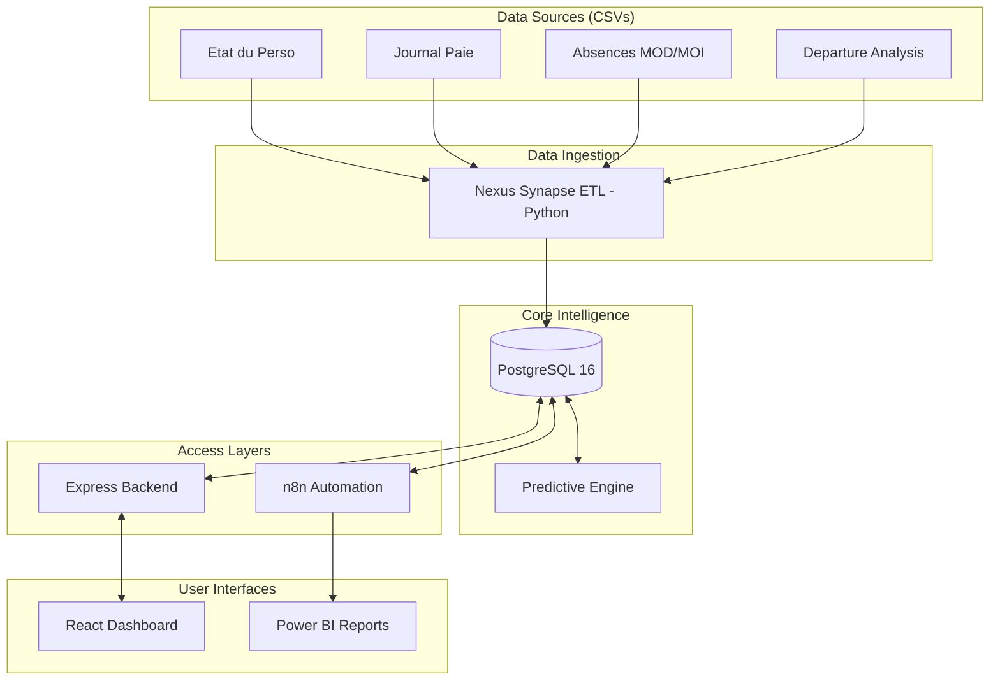

# 🚀 RECORDATI.HR -- Intelligence Hub v2.0

> **Empowering HR with Data Analytics, Predictive AI, and Automated Intelligence.**

RecordatiHR is a state-of-the-art HR Intelligence platform designed to transform raw industrial data into actionable workforce insights. Built with a robust technical stack and an "Industrial-First" mentality, it provides executive-level dashboards, predictive turnover modeling, and automated ETL pipelines.

---

## 💎 Key Features

- **📊 Executive Dashboard**: Real-time tracking of headcount, gender distribution, and key performance indicators.
- **📉 Turnover Analytics**: Deep-dive analysis of terminations, resignation factors, and historical trends.
- **🕒 Absenteeism Command Center**: Multi-dimensional tracking of absences (Medical, Social, Accident, etc.) with monthly trend visualization.
- **🧠 Nexus Predictive AI**: Machine learning-driven risk assessment identifying high-risk talent before they leave.
- **⚙️ Nexus Synapse ETL**: Advanced Python-based data ingestion engine translating complex CSV exports into clean PostgreSQL relational data.
- **🔒 Enterprise Security**: Role-based access control (RBAC) with JWT authentication and secure backend proxying.
- **⚡ Automation Layer**: Integrated n8n workflows for cross-platform alerts (Slack/Gmail) and Power BI synchronization.

---

## 🛠️ Technology Stack

| Layer | Technologies |
|-------|--------------|
| **Frontend** | React 19, Vite, Recharts, Lucide, CSS Glassmorphism |
| **Backend** | Node.js (Express), JWT, PostgreSQL Client |
| **Data Engine** | Python 3.x, Pandas, Psycopg2, Nexus Synapse ETL |
| **Intelligence** | Random Forest / Logistic Regression models |
| **Workflow** | n8n (Automation), PostgreSQL 16 (Storage) |
| **Deployment** | Docker, Docker Compose |

---

## 🏗️ Architecture



---

## 🚀 Getting Started

### 1. Requirements
- Docker & Docker Compose
- Node.js (v18+) & Python (v3.9+)

### 2. Quick Install
```bash
# Clone the repository
git clone <repo_url>
cd project-root

# Environment Setup
cp .env.example .env
# Edit .env with your PostgreSQL and JWT secrets

# Start Infrastructure
docker compose up -d
```

### 3. Data Ingestion (Industrial Pipelines)
RecordatiHR now features two ingestion paths:
- **Nexus Synapse (Legacy)**: `python scripts/csv_to_db_etl.py` (For simple flat-file sync).
- **Enhanced Industrial ETL (New)**: `python scripts/enhanced_industrial_etl.py` (Full Star Schema with 2022-2025 support).

To trigger the full warehouse build:
```bash
# From the root directory
python scripts/enhanced_industrial_etl.py
```
This script will:
1. Initialize the **Enhanced Star Schema** (`enhanced_dw_schema.sql`).
2. Process all multi-year TPS files in the `/CSV` folder.
3. Calculate advanced metrics (Availability rate, detailed absence types, multi-year overtime).
4. Populate the `fact_attendance` table for high-performance visualization.

### 4. Run the Apps
- **Backend**: `cd web && npm install && npm start` (Port 3000)
- **Frontend**: `cd OpaliaHR && npm install && npm run dev` (Port 5173)

### 5. User Data Upload Dashboard
A new self-contained Streamlit app lets users upload their own HR CSV/XLSX files, performs column detection/mapping, builds a warehouse, and displays a dashboard.

```bash
cd "c:\Users\USER\Desktop\PFE BA\Project 2"
python -m pip install --upgrade pip setuptools wheel
pip install -r requirements.txt
streamlit run scripts/user_uploaded_dashboard.py
```

> If you are using Python 3.14, the package pins include `numpy==2.3.3` and `pandas==2.3.3`, which are compatible with this interpreter.

The app generates:
- `user_uploaded_dw.db` (SQLite warehouse)
- CSV exports of the generated tables
- a live web dashboard with Overview, Turnover, Absence, Recruitment, Productivity, Training, Diversity, People Care, and Prediction pages

---

## 📑 Module Documentation

### [Enhanced Industrial ETL](./scripts/enhanced_industrial_etl.py)
The state-of-the-art ingestion engine that replaces manual flat-file tracking with a formal **Data Warehouse** architecture:
- **Star Schema**: Optimized for BI tools like Power BI and internal React analytics.
- **Detailed Tracking**: Supports 13+ absence types, 3 overtime categories, and automated site/department mapping.
- **Scalability**: Handles 4+ years of historical data from the `CSV/` directory.

### [Nexus Synapse ETL](./scripts/csv_to_db_etl.py)
The heartbeat of the system. It handles:
- **Phase 1: Discovery**: Ensures referential integrity by identifying all unique employee IDs across all files.
- **Phase 2: Master Sync**: Updates profiles, departments, and roles.
- **Phase 4: Absence Injection**: Distributes yearly totals across months for granular visualization.
- **Phase 7: AI Activation**: Computes Turnover Risk Scores based on age, tenure, and engagement signals.

### [HR Intelligence Dashboard](./OpaliaHR/src/components/pages/Page3_Turnover.jsx)
A React-based analytical suite providing:
- Global filters by Year and Department.
- Dynamic KPI cards with trend indicators.
- Distribution charts (Gender, Department, Risk).

### [Predictive Engine](./scripts/attrition_model.py)
Utilizes a trained Random Forest model to analyze 15+ features including tenure, salary position, and absence history to predict probability of departure.

---

## 🔐 Security & Roles
1. **Membre RH**: Access to basic dashboards and data viewing.
2. **Responsable RH**: Full analytical access + leave management.
3. **Admin**: System configuration + AI model management + User CRUD.

---

## 📈 Power BI Integration
The n8n workflow `n8n/workflow-rh-architecture.json` provides an automated bridge to Microsoft Power BI, triggering dataset refreshes upon successful data import.

---
*Created with ❤️ for Recordati Performance Excellence.*
