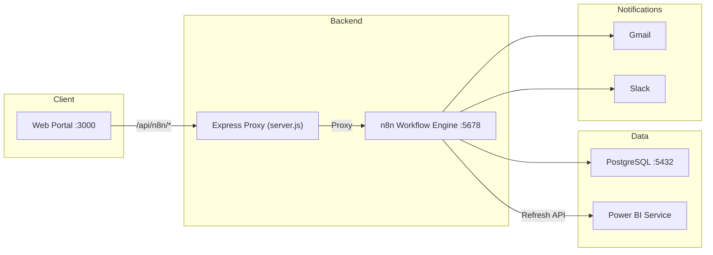
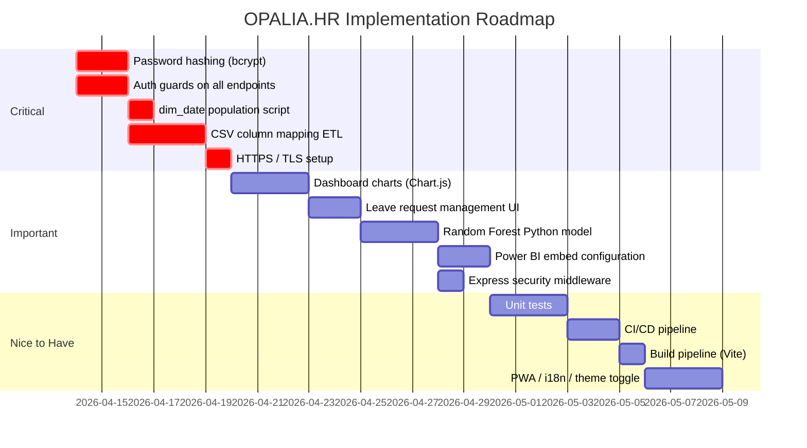

# OPALIA.HR — Performance Benchmark & Full Gap Analysis

> **Project**: HR Data Portal with n8n automation, PostgreSQL, Power BI, predictive turnover model
> **Scan date**: 2026-04-11

---

## 1. Project Architecture Overview

---

## 2. Completion Scorecard

| Layer | Component | Status | Completion |
|-------|-----------|--------|------------|
| **Infrastructure** | Docker Compose (PG + n8n) | ✅ Done | 100% |
| **Infrastructure** | `.env` / `.env.example` | ✅ Done | 100% |
| **Infrastructure** | SQL schema (`init.sql`) | ✅ Done | 95% |
| **Backend** | Express static server + CORS proxy | ✅ Done | 90% |
| **Backend** | n8n workflow JSON (source + patched) | ✅ Done | 85% |
| **Backend** | Patch script (`patch_workflow.py`) | ✅ Done | 100% |
| **Backend** | JWT authentication (login) | ✅ Done | 75% |
| **Frontend** | Landing page (`index.html`) | ✅ Done | 80% |
| **Frontend** | Login page | ✅ Done | 85% |
| **Frontend** | Employee lookup + update | ✅ Done | 80% |
| **Frontend** | Excel upload | ✅ Done | 70% |
| **Frontend** | New employee form | ✅ Done | 75% |
| **Frontend** | Dashboard (native KPIs) | ✅ Done | 60% |
| **Frontend** | Role pages (membre/resp/admin) | ✅ Done | 55% |
| **Frontend** | CSS design system | ✅ Done | 85% |
| **Power BI** | DAX measures (README) | 📄 Documented | 50% |
| **Power BI** | Embed iframe | ⚠️ Placeholder | 20% |
| **Power BI** | Auto-refresh via n8n | ⚠️ Placeholder IDs | 30% |
| **ML / Prediction** | Logistic regression in n8n Code | ✅ Done | 70% |
| **ML / Prediction** | Random Forest (Python) | ❌ Not built | 0% |
| **Security** | Password hashing | ❌ Plaintext | 10% |
| **Security** | HTTPS / TLS | ❌ None | 0% |
| **Testing** | Unit / integration tests | ❌ None | 0% |
| **CI/CD** | Pipeline | ❌ None | 0% |
| **Docs** | README | ✅ Done | 90% |
| **Docs** | API examples (`.http`) | ✅ Done | 100% |

### Overall estimated completion: **~60%**

---

## 3. Performance Benchmark

### 3.1 — Infrastructure

| Metric | Current state | Assessment |
|--------|--------------|------------|
| **Database engine** | PostgreSQL 16 Alpine | ✅ Excellent — lightweight, production-grade |
| **Container health** | Healthcheck on `pg_isready` with 5s interval, 10 retries | ✅ Solid |
| **n8n version** | `1.81.0` pinned | ✅ Good — deterministic builds |
| **Volume persistence** | Named volumes `rh_pgdata`, `rh_n8n_data` | ✅ Correct |
| **Init script** | Mounted as `/docker-entrypoint-initdb.d/01-init.sql` | ✅ Runs on first boot only |
| **n8n depends_on** | `service_healthy` condition | ✅ Proper ordering |

> [!TIP]
> **Indexing**: The schema includes 11 indexes across fact tables — good coverage for dashboard queries. Consider adding a composite index on `predictions_log(employee_id, date_prediction)` for time-series prediction lookups.

### 3.2 — Database Schema Quality

| Aspect | Score | Notes |
|--------|-------|-------|
| Star schema design | ⭐⭐⭐⭐ | Dimension + fact tables properly separated |
| Foreign keys & cascades | ⭐⭐⭐⭐ | `ON DELETE CASCADE` on fact → employee |
| Data types | ⭐⭐⭐⭐ | `NUMERIC` for currency, `JSONB` for features |
| SCD support | ⭐⭐⭐ | `dim_employee` has `valid_from/valid_to` but not wired |
| Trigger automation | ⭐⭐⭐⭐ | `updated_at` trigger on `fact_employee` |
| Seed data | ⭐⭐⭐ | 3 demo employees, 4 demo users |

> [!WARNING]
> `dim_date` table is created but never populated. Power BI date intelligence (`dim_date[year]`, `dim_date[month]`) will fail without a calendar population script.

### 3.3 — Backend / Express Server

| Metric | Current state | Assessment |
|--------|--------------|------------|
| **Framework** | Express 4.21 | ✅ Stable LTS |
| **Proxy pattern** | `app.all('/api/n8n/*')` → n8n webhooks | ✅ Avoids CORS entirely |
| **Error handling** | `502` with descriptive message on proxy failure | ✅ OK |
| **SPA fallback** | `*` route serves `index.html` (skip dotfiles) | ✅ Correct |
| **Static serving** | `express.static(publicDir)` | ✅ Standard |
| **Rate limiting** | ❌ None | 🔴 Missing |
| **Compression** | ❌ None (`gzip` / `brotli`) | 🟡 Missing |
| **Helmet / security headers** | ❌ None | 🔴 Missing |
| **Logging** | Single `console.log` at startup | 🟡 No request logging |
| **Graceful shutdown** | ❌ Not handled | 🟡 Missing |

### 3.4 — Frontend Performance

| Metric | Current state | Assessment |
|--------|--------------|------------|
| **Total CSS** | 1 file, 6.7 KB | ✅ Excellent — minimal |
| **Total JS** | 2 files (auth 720 B + config 653 B) + inline scripts | ✅ Very light |
| **External dependencies** | 0 (no frameworks, no CDN libs) | ✅ Fastest possible |
| **Google Fonts** | ❌ Falls back to Segoe UI / system font | 🟡 Functional but not premium |
| **Images** | 1 logo (29 KB PNG) | ✅ Very light |
| **Total page weight** | ~40 KB per page (HTML + CSS + JS + logo) | ✅ Excellent |
| **Lazy loading** | N/A (no heavy assets) | ✅ Not needed |
| **Minification** | ❌ None (no build step) | 🟡 Would benefit from build pipeline |
| **Service Worker / PWA** | ❌ Not implemented | 🟡 Nice-to-have |

> [!NOTE]
> Page load performance is inherently excellent because the stack has zero external framework dependencies. Each page is ~40 KB total — well under budget for any device.

### 3.5 — Security Benchmark

| Vulnerability | Severity | Status |
|---------------|----------|--------|
| **Plaintext passwords** in `init.sql` and n8n Code node | 🔴 Critical | Passwords stored/compared as plain strings |
| **JWT secret** is a static default string in `.env` | 🔴 Critical | `change-this-jwt-secret-min-32-chars!!` shipped as-is |
| **No HTTPS** | 🔴 Critical | All traffic including JWT tokens in cleartext |
| **No CSP headers** | 🟡 Medium | XSS mitigation missing |
| **No rate limiting** on `/auth/login` | 🟡 Medium | Brute-force possible |
| **Demo credentials exposed** in `login.html` UI | 🟡 Medium | Visible to all users |
| **JWT expiry**: 24 hours | 🟡 Low | Long-lived tokens increase window of attack |
| **No token refresh** mechanism | 🟡 Low | User must re-login after 24h |
| **Employee update** endpoint has no auth check | 🟡 Medium | `PUT /api/employee/update` is unauthenticated |
| **`new-employee.html`** has no auth guard | 🟡 Medium | Anyone can submit employee forms |

---

## 4. What Has Been Built (Completed Features)

### ✅ Infrastructure
- [x] Docker Compose with PostgreSQL 16 + n8n 1.81.0
- [x] Healthcheck-based service dependencies
- [x] Named volume persistence
- [x] Environment-variable-driven configuration
- [x] SQL schema with star schema (7 tables + 1 trigger)
- [x] Demo seed data (3 employees, 4 users)

### ✅ Backend
- [x] Express proxy server eliminating CORS issues
- [x] n8n workflow JSON with 7 webhook endpoints
- [x] JWT login via n8n Code node (HS256)
- [x] Role-based data endpoints (membre/responsable/admin)
- [x] Employee CRUD endpoints
- [x] Leave request endpoint
- [x] Patch script to regenerate workflow from source JSON
- [x] KPI alert thresholds (turnover > 15%, absenteeism > 5%)

### ✅ Frontend
- [x] 9 HTML pages covering full user journey
- [x] Dark-theme design system with CSS custom properties
- [x] Glassmorphism header with backdrop blur
- [x] Responsive layout with mobile breakpoint (760px)
- [x] JWT session management (localStorage)
- [x] Login with error handling + webhook-inactive detection
- [x] Employee lookup + inline edit form
- [x] Excel upload via n8n Form Trigger
- [x] New employee form targeting n8n
- [x] Native dashboard with computed KPIs (employees, departments, avg absences, risk)
- [x] Data table with preferred column ordering
- [x] Progress bar animation for uploads
- [x] Logout functionality across role pages

### ✅ Documentation
- [x] Comprehensive README (208 lines)
- [x] API examples `.http` file
- [x] DAX measures documented
- [x] Power BI star schema design documented

---

## 5. What Is Yet to Be Added (Gap Analysis)

### 🔴 Critical — Must Have

| # | Item | Layer | Details |
|---|------|-------|---------|
| 1 | **Password hashing (bcrypt)** | Security | `app_users.password_hash` stores plaintext. Implement bcrypt in the n8n login Code node and seed script. |
| 2 | **JWT secret rotation** | Security | Generate a strong random secret; never ship the default. Add rotation mechanism. |
| 3 | **HTTPS / TLS** | Infrastructure | Add nginx reverse proxy with Let's Encrypt or self-signed cert for dev. |
| 4 | **Auth guards on all endpoints** | Security | `PUT /api/employee/update`, `GET /api/employee`, `GET /api/employees`, `POST /api/leave-request`, and `new-employee.html` have **no JWT verification**. |
| 5 | **`dim_date` population** | Database | The calendar table is empty. DAX measures referencing `dim_date[year]` / `dim_date[month]` will fail. Need a generation script (e.g., 2015–2035). |
| 6 | **CSV-to-DB column mapping** | Data Pipeline | The raw CSV files (`ETAT DU PERSO.csv`, `TPS JANV - DEC *.csv`, etc.) have French headers that don't match `fact_employee` columns. A mapping ETL step is required. |
| 7 | **Power BI dataset refresh credentials** | Integration | OAuth2 credentials (tenant/client/secret) are empty. Dataset ID is a placeholder UUID. |

### 🟡 Important — Should Have

| # | Item | Layer | Details |
|---|------|-------|---------|
| 8 | **Random Forest model (Python)** | ML | README mentions it; currently only logistic regression exists in n8n Code. Build a Python microservice or `Execute Command` node. |
| 9 | **Leave request management UI** | Frontend | `POST /api/leave-request` exists but there's no page to list/approve/reject leave requests. |
| 10 | **User management admin page** | Frontend | Admin page shows data but can't create/edit/delete `app_users`. |
| 11 | **Dashboard charts & visualizations** | Frontend | Dashboard only shows 4 numeric KPI cards + a raw table. No charts (bar, pie, line, heatmap). |
| 12 | **Power BI embed page** | Frontend | `dashboard.html` was renamed to a native dashboard; the PBI iframe embed (`POWER_BI_EMBED_URL`) is unused. |
| 13 | **Role-based navigation** | Frontend | All nav links are visible to all roles. Should hide pages the user can't access. |
| 14 | **Request logging / audit trail** | Backend | No request logging on the Express server. Add Morgan or similar. |
| 15 | **Error boundary / 404 page** | Frontend | No custom 404 page. The SPA fallback serves `index.html` for any unknown path. |
| 16 | **Loading states / skeletons** | Frontend | Pages show "Chargement…" text. Should use skeleton loaders or spinners. |
| 17 | **Express `compression` middleware** | Backend | Enable gzip/brotli for static assets. |
| 18 | **Express `helmet` middleware** | Backend | Add security headers (CSP, HSTS, X-Frame-Options). |
| 19 | **Rate limiting** | Backend | Add `express-rate-limit` on `/api/n8n/auth/login`. |
| 20 | **Graceful shutdown** | Backend | Handle `SIGTERM`/`SIGINT` to close connections cleanly. |

### 🟢 Nice to Have — Could Have

| # | Item | Layer | Details |
|---|------|-------|---------|
| 21 | **Unit & integration tests** | Testing | Zero test coverage. Add Jest for Express, Playwright for frontend. |
| 22 | **CI/CD pipeline** | DevOps | No GitHub Actions / GitLab CI. Automate build, test, deploy. |
| 23 | **Build pipeline** (minification, bundling) | Frontend | No Vite/Webpack. CSS/JS could be minified for production. |
| 24 | **PWA / Service Worker** | Frontend | Offline capability for the portal. |
| 25 | **i18n (English/French toggle)** | Frontend | Currently French-only. |
| 26 | **Dark/Light theme toggle** | Frontend | Currently dark-only. CSS variables are ready for theming. |
| 27 | **Employee photo upload** | Frontend | No profile picture support. |
| 28 | **Notification center** | Frontend | No in-app notification feed (currently only email/Slack). |
| 29 | **Data export (CSV/PDF)** | Frontend | No export functionality from the dashboard/tables. |
| 30 | **SCD implementation** | Database | `dim_employee` has `valid_from/valid_to` columns but no trigger to maintain slowly changing dimensions. |
| 31 | **Database backup automation** | Infrastructure | No `pg_dump` cron or script. |
| 32 | **Docker prod hardening** | Infrastructure | No resource limits, no read-only filesystem, no non-root user enforcement. |
| 33 | **API versioning** | Backend | Current paths like `/api/employee` should be versioned (`/api/v1/employee`). |
| 34 | **Pagination** on employee list | Backend / Frontend | `GET /api/employees` returns all rows. Will break with large datasets. |
| 35 | **`.gitignore` expansion** | DevOps | Currently ignores only 3 patterns. Should ignore `.env`, `*.csv`, Docker volumes, IDE files. |

---

## 6. File-by-File Health Summary

| File | Size | Health | Notes |
|------|------|--------|-------|
| [docker-compose.yml](file:///c:/Users/USER/Desktop/Project%202/docker-compose.yml) | 1.6 KB | ✅ | Clean, well-structured |
| [init.sql](file:///c:/Users/USER/Desktop/Project%202/init.sql) | 8.1 KB | ⚠️ | Plaintext passwords in seed data |
| [server.js](file:///c:/Users/USER/Desktop/Project%202/web/server.js) | 2.2 KB | ⚠️ | No security middleware, no logging |
| [app.css](file:///c:/Users/USER/Desktop/Project%202/web/public/css/app.css) | 6.7 KB | ✅ | Well-organized design system |
| [auth.js](file:///c:/Users/USER/Desktop/Project%202/web/public/js/auth.js) | 720 B | ✅ | Clean, minimal |
| [config.js](file:///c:/Users/USER/Desktop/Project%202/web/public/js/config.js) | 653 B | ⚠️ | Placeholder URLs |
| [index.html](file:///c:/Users/USER/Desktop/Project%202/web/public/index.html) | 1.8 KB | ✅ | Functional landing |
| [login.html](file:///c:/Users/USER/Desktop/Project%202/web/public/login.html) | 2.9 KB | ⚠️ | Demo creds visible in UI |
| [dashboard.html](file:///c:/Users/USER/Desktop/Project%202/web/public/dashboard.html) | 5.4 KB | ⚠️ | No charts, basic KPI cards only |
| [employee.html](file:///c:/Users/USER/Desktop/Project%202/web/public/employee.html) | 4.1 KB | ⚠️ | No auth guard on update |
| [upload.html](file:///c:/Users/USER/Desktop/Project%202/web/public/upload.html) | 3.0 KB | ✅ | Properly guarded |
| [new-employee.html](file:///c:/Users/USER/Desktop/Project%202/web/public/new-employee.html) | 3.0 KB | ⚠️ | No auth guard |
| [membre-rh.html](file:///c:/Users/USER/Desktop/Project%202/web/public/membre-rh.html) | 2.2 KB | ✅ | JWT-guarded |
| [responsable-rh.html](file:///c:/Users/USER/Desktop/Project%202/web/public/responsable-rh.html) | 2.4 KB | ✅ | JWT-guarded |
| [admin.html](file:///c:/Users/USER/Desktop/Project%202/web/public/admin.html) | 2.4 KB | ✅ | JWT-guarded |
| [patch_workflow.py](file:///c:/Users/USER/Desktop/Project%202/scripts/patch_workflow.py) | 9.8 KB | ✅ | Well-structured transformer |
| [README.md](file:///c:/Users/USER/Desktop/Project%202/README.md) | 11.5 KB | ✅ | Comprehensive |
| [api-examples.http](file:///c:/Users/USER/Desktop/Project%202/api-examples.http) | 1.3 KB | ✅ | All endpoints covered |

---

## 7. Data Files Inventory (Raw CSVs)

These files exist in the project root but have **no automated ETL pipeline** to load them into PostgreSQL:

| File | Size | Likely Target Table |
|------|------|-------------------|
| `ETAT DU PERSO.csv` | 140 KB | `fact_employee` |
| `TPS JANV - DEC 2022.csv` | 61 KB | `fact_absence` (attendance/hours) |
| `TPS JANV - DEC 2023.csv` | 60 KB | `fact_absence` |
| `TPS JANV - DEC 2024.csv` | 61 KB | `fact_absence` |
| `HS FEV 2026.csv` | 4 KB | Overtime (no table exists) |
| `Journal Paie 022026.csv` | 33 KB | Payroll (no table exists) |
| `SORTANTS .csv` | 5.7 KB | `fact_turnover` |
| `INDUS DEPARTURES.csv` | 1.5 KB | `fact_turnover` |
| `Act (dip).csv` | 11 KB | Unknown mapping |
| `Indicateurs RH.xlsx` | 11 KB | KPI reference definitions |

> [!CAUTION]
> None of these raw files are being loaded into the database. The n8n workflow expects Excel uploads with specific column names (`employee_id`, `nom`, `prenom`, etc.), but these CSVs have different French headers. **A column-mapping ETL script is the single biggest functional gap.**

---

## 8. Priority Roadmap

---

## 9. Summary

The OPALIA.HR project has a **solid architectural foundation** — the Docker setup, database schema, n8n workflow design, and web portal structure are all well-conceived. The ~60% completion reflects a system that has the skeleton and core flows working but is **missing critical production-readiness features** (security hardening, data ingestion pipeline, visualization depth) and several planned features (Random Forest model, leave management, admin CRUD).

**Top 3 priorities to address immediately:**
1. 🔴 **Security**: Hash passwords, enforce auth on all endpoints, rotate JWT secret
2. 🔴 **Data pipeline**: Build the CSV → PostgreSQL ETL with column mapping
3. 🟡 **Dashboard**: Add Chart.js visualizations to replace raw data tables
